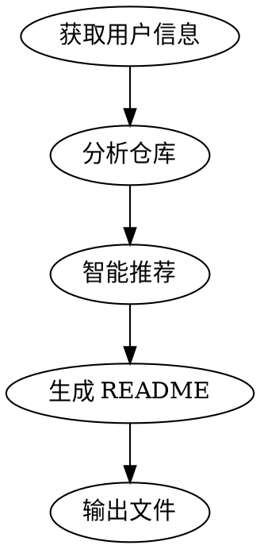

# GitHub Profile Beautifier

一键生成漂亮的 GitHub 个人主页 README。自动检测仓库、分析技术栈、智能推荐项目和主题。

## When to Use

- 用户想要创建 GitHub 个人主页
- 用户想要美化现有的 README
- 用户想要展示项目和技术栈
- 用户输入 `/github-profile-beautifier [username]`

**When NOT to Use:**
- 用户只是想修改现有 README 的小部分
- 用户已经有完美的 README，只是想微调
- 用户想要创建非 GitHub 的个人主页

## Core Pattern

### 执行流程



### Step 1: 获取用户信息

使用 `gh` 命令获取用户基本信息和仓库列表：

```bash
# 获取用户信息
gh api user --jq '.login,.name,.bio'

# 获取仓库列表
gh repo list $USERNAME --limit 50 --json name,description,primaryLanguage,url,updatedAt,stargazerCount
```

**关键点：**
- 使用 `gh` 命令，不依赖外部 API
- 限制 50 个仓库，避免信息过载
- 获取关键字段：name, description, language, stars, update time

**错误处理：**
```bash
# 检查用户是否存在
if ! gh api users/$USERNAME > /dev/null 2>&1; then
  echo "错误：用户 $USERNAME 不存在"
  exit 1
fi

# 检查 gh CLI 是否安装
if ! command -v gh &> /dev/null; then
  echo "错误：请先安装 gh CLI"
  echo "安装命令：brew install gh"
  exit 1
fi
```

### Step 2: 分析仓库

分析仓库信息，识别：
- 主要项目（star 数高、更新频繁）
- 技术栈（从语言分布和 package.json）
- 项目分类（AI Agent、前端、后端、工具等）

**分析逻辑：**
```typescript
// 检查是否有仓库
if (repos.length === 0) {
  // 生成基础 README，提示用户添加仓库
  return generateBasicReadme(username);
}

// 按 star 数排序
const sortedRepos = repos.sort((a, b) => b.stargazerCount - a.stargazerCount);

// 筛选 Top 5 项目（排除 fork）
const topProjects = sortedRepos
  .filter(repo => !repo.isFork)
  .slice(0, 5);

// 统计语言分布
const languageStats = repos.reduce((acc, repo) => {
  const lang = repo.primaryLanguage?.name || 'Unknown';
  acc[lang] = (acc[lang] || 0) + 1;
  return acc;
}, {});
```

### Step 3: 智能推荐

根据分析结果推荐：
- **项目展示**：Top 5 项目
- **主题风格**：根据现有 README 风格
- **技术栈徽章**：从语言分布生成
- **Widget 组合**：统计卡片、连续贡献等

**推荐逻辑：**
- 如果用户有 README → 分析现有风格，保持一致
- 如果用户无 README → 使用 radical 主题（流行且美观）
- 如果仓库有 AI 相关项目 → 突出展示 AI Agent 部分

### Step 4: 生成 README

使用模板生成完整的 README.md：

**模板结构：**
```markdown
<div align="center">

# {用户名}

## {个人介绍}

[打字动画]

</div>

---

## 📊 GitHub 统计

[统计卡片]

---

## 🤖 项目展示

[项目表格]

---

## 💻 技术栈

[技术栈徽章]

---

## 📞 联系方式

[联系按钮]

</div>
```

## Quick Reference

| 命令 | 说明 | 示例 |
|------|------|------|
| `/github-profile-beautifier` | 交互式生成 | 询问用户名 |
| `/github-profile-beautifier username` | 指定用户名 | `/github-profile-beautifier wu529778790` |

## Implementation

### 完整执行流程

```
1. 检查 gh CLI 是否安装
   - 未安装 → 提示用户安装
   - 已安装 → 继续

2. 获取用户信息
   gh api user --jq '.login,.name,.bio'
   gh repo list $USERNAME --limit 50 --json name,description,primaryLanguage,url,updatedAt,stargazerCount

3. 分析仓库
   - 按 star 数排序
   - 统计语言分布
   - 识别主要项目

4. 智能推荐
   - 推荐 Top 5 项目
   - 推荐主题（radical/tokyonight/dracula）
   - 推荐技术栈徽章

5. 生成 README
   - 使用 Handlebars 模板
   - 填充用户数据
   - 输出完整 README.md

6. 输出结果
   - 显示在终端
   - 可选：保存到文件
```

### 模板配置

**主题配置文件 (themes.json)**
```json
{
  "radical": {
    "name": "Radical",
    "colors": ["#fe428e", "#f8d847", "#a9fef7"],
    "stats_theme": "radical"
  },
  "tokyonight": {
    "name": "Tokyo Night",
    "colors": ["#7aa2f7", "#bb9af7", "#9ece6a"],
    "stats_theme": "tokyonight"
  },
  "dracula": {
    "name": "Dracula",
    "colors": ["#ff79c6", "#bd93f9", "#50fa7b"],
    "stats_theme": "dracula"
  }
}
```

**技术栈徽章映射**
```json
{
  "JavaScript": "javascript",
  "TypeScript": "typescript",
  "Vue": "vuedotjs",
  "React": "react",
  "Node.js": "nodedotjs",
  "Python": "python",
  "Go": "go",
  "Docker": "docker"
}
```

## Common Mistakes

| 错误 | 正确做法 | 原因 |
|------|----------|------|
| 使用外部 API 获取统计数据 | 使用 `gh` 命令本地获取 | API 可能不稳定或被暂停 |
| 硬编码主题颜色 | 从配置文件读取 | 方便用户自定义 |
| 忽略用户现有 README | 分析现有风格并匹配 | 保持一致性 |
| 展示所有仓库 | 智能推荐 Top 5 | 避免信息过载 |
| 使用复杂的模板引擎 | 使用简单的字符串替换 | 降低依赖和复杂度 |
| 不检查 gh CLI 是否安装 | 先检查再执行 | 避免运行时错误 |
| 不处理用户不存在的情况 | 先验证用户存在性 | 避免无效操作 |
| 使用不稳定的外部 API | 使用本地 gh 命令 | 保证可靠性 |

## Real-World Impact

**Before (没有 skill):**
- 使用不稳定的外部 API
- 图片裂开（404 错误）
- 信息过载（展示所有仓库）
- 风格不一致
- 不处理错误情况

**After (有 skill):**
- 使用本地 `gh` 命令
- 所有图片正常显示
- 智能推荐 Top 5 项目
- 风格统一美观
- 完善的错误处理

## Edge Cases

### 1. 用户不存在
```bash
# 检查用户是否存在
if ! gh api users/$USERNAME > /dev/null 2>&1; then
  echo "错误：用户 $USERNAME 不存在"
  exit 1
fi
```

### 2. 没有仓库
```typescript
if (repos.length === 0) {
  // 生成基础 README，提示用户添加仓库
  return generateBasicReadme(username);
}
```

### 3. 所有仓库都是 fork
```typescript
// 筛选非 fork 仓库
const nonForkRepos = repos.filter(repo => !repo.isFork);

if (nonForkRepos.length === 0) {
  // 使用所有仓库，包括 fork
  topProjects = repos.slice(0, 5);
} else {
  // 只使用非 fork 仓库
  topProjects = nonForkRepos.slice(0, 5);
}
```

### 4. gh CLI 未安装
```bash
if ! command -v gh &> /dev/null; then
  echo "错误：请先安装 gh CLI"
  echo "安装命令：brew install gh"
  exit 1
fi
```

### 5. 网络问题
```bash
# 检查网络连接
if ! gh api user > /dev/null 2>&1; then
  echo "错误：无法连接到 GitHub"
  echo "请检查网络连接"
  exit 1
fi
```
